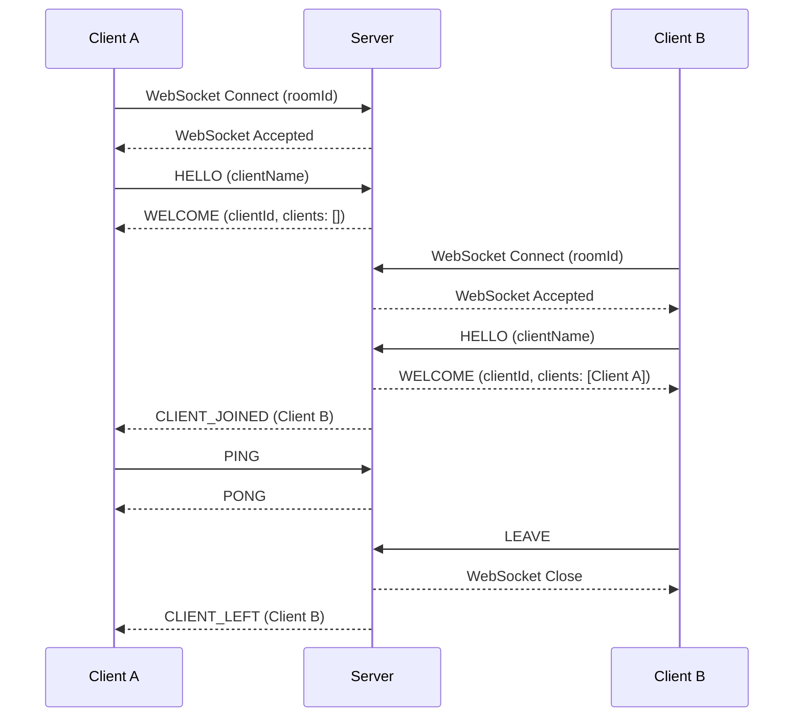
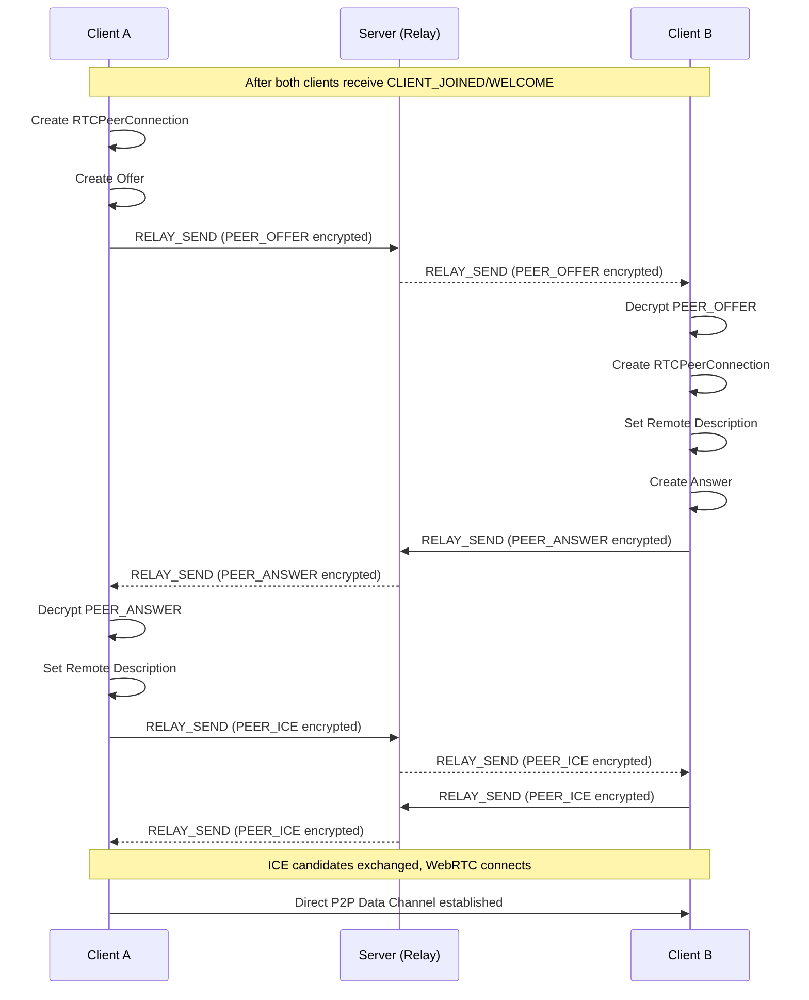

# Protocol Specification

This document specifies the communication protocols used in Clipboard Sync, including encryption and message payloads.

## Encryption

### P2P Transport Encryption

P2P connections use WebRTC's built-in secure transport (DTLS) and do not require additional application-level encryption.

### Relay Transport Encryption

Messages sent through the Relay server are end-to-end encrypted using the following scheme:

**Algorithm**

- **Cipher**: AES-256-GCM (Authenticated Encryption with Associated Data)
- **Key Derivation**: Argon2 (Argon2id, default parameters from [`argon2` crate](https://docs.rs/argon2/latest/argon2/))
- **Salt**: 128-bit (16 bytes), randomly generated per message
- **Nonce/IV**: 96-bit (12 bytes), randomly generated per encryption

**Encrypted Payload Structure**

```typescript
{
  iv: string;         // Base64-encoded nonce (12 bytes)
  ciphertext: string; // Base64-encoded encrypted data
  salt: string;       // Base64-encoded salt (16 bytes)
}
```

**Encryption Process**

1. Generate random 16-byte salt
2. Derive 256-bit key from user secret using Argon2(secret, salt)
3. Generate random 12-byte nonce
4. Encrypt plaintext with AES-256-GCM(key, nonce, plaintext)
5. Return base64-encoded `iv`, `ciphertext`, and `salt`

**Decryption Process**

1. Base64-decode `iv`, `ciphertext`, and `salt`
2. Derive 256-bit key from user secret using Argon2(secret, salt)
3. Decrypt with AES-256-GCM(key, nonce, ciphertext)
4. Return plaintext or error if authentication fails

## Client-Server Protocol

Communication between client and server uses WebSocket with JSON-encoded messages.

### Connection Flow



### Client → Server Messages

#### HELLO
Initial handshake message. Must be sent before any other messages.

```typescript
{
  type: "HELLO",
  payload: {
    version: number,    // Protocol version (currently 1)
    clientName: string  // Display name (1-64 characters)
  }
}
```

#### PING
Heartbeat to keep connection alive.

```typescript
{
  type: "PING"
}
```

#### LEAVE
Graceful disconnect notification.

```typescript
{
  type: "LEAVE"
}
```

#### RELAY_BROADCAST
Broadcasts encrypted payload to all clients in room (except sender).

```typescript
{
  type: "RELAY_BROADCAST",
  payload: EncryptedPayload  // See encryption section
}
```

#### RELAY_SEND
Sends encrypted payload to specific client.

```typescript
{
  type: "RELAY_SEND",
  targetId: string,          // Target client UUID
  payload: EncryptedPayload  // See encryption section
}
```

### Server → Client Messages

#### WELCOME
Response to `HELLO`, provides client identity and room state.

```typescript
{
  type: "WELCOME",
  payload: {
    clientId: string,      // Assigned UUIDv4
    clients: Array<{       // Already-connected clients
      id: string,          // Client UUID
      name: string         // Client name
    }>
  }
}
```

#### PONG
Heartbeat response.

```typescript
{
  type: "PONG"
}
```

#### CLIENT_JOINED
Notification when new client joins room.

```typescript
{
  type: "CLIENT_JOINED",
  payload: {
    id: string,    // Client UUID
    name: string   // Client name
  }
}
```

#### CLIENT_LEFT
Notification when client leaves room.

```typescript
{
  type: "CLIENT_LEFT",
  payload: {
    id: string,    // Client UUID
    name: string   // Client name
  }
}
```

#### RELAY_BROADCAST
Forwarded broadcast message from another client.

```typescript
{
  type: "RELAY_BROADCAST",
  senderId: string,          // Sender's client UUID
  payload: EncryptedPayload  // See encryption section
}
```

#### RELAY_SEND
Forwarded targeted message from another client.

```typescript
{
  type: "RELAY_SEND",
  senderId: string,          // Sender's client UUID
  payload: EncryptedPayload  // See encryption section
}
```

#### ERROR
Error notification from server.

```typescript
{
  type: "ERROR",
  payload: {
    message: string  // Human-readable error description
  }
}
```

## Client-Client Protocol

Clients communicate via messages sent through P2P or Relay transports.

- **Via P2P**: Messages rely on WebRTC's built-in encryption
- **Via Relay**: Messages are encrypted using the scheme described above

### P2P Connection Flow



### Message Types

#### CLIPBOARD_UPDATE
Synchronizes clipboard content.

```typescript
{
  type: "CLIPBOARD_UPDATE",
  id: string,        // UUIDv4 for deduplication
  content: string,   // Clipboard text content
  timestamp: number  // Unix timestamp (milliseconds)
}
```

**Transport**: Sent via P2P (WebRTC encryption) or Relay (application-level encryption)

#### PEER_OFFER
WebRTC connection offer for P2P negotiation.

```typescript
{
  type: "PEER_OFFER",
  sdp: {
    type: "offer",
    sdp?: string
  }
}
```

**Transport**: Sent via `RELAY_SEND` (application-level encryption)

#### PEER_ANSWER
WebRTC connection answer for P2P negotiation.

```typescript
{
  type: "PEER_ANSWER",
  sdp: {
    type: "answer",
    sdp?: string
  }
}
```

**Transport**: Sent via `RELAY_SEND` (application-level encryption)

#### PEER_ICE
WebRTC ICE candidate exchange.

```typescript
{
  type: "PEER_ICE",
  candidate: {
    candidate?: string,
    sdpMid?: string,
    sdpMLineIndex?: number,
    usernameFragment?: string
  }
}
```

**Transport**: Sent via `RELAY_SEND` (application-level encryption)
